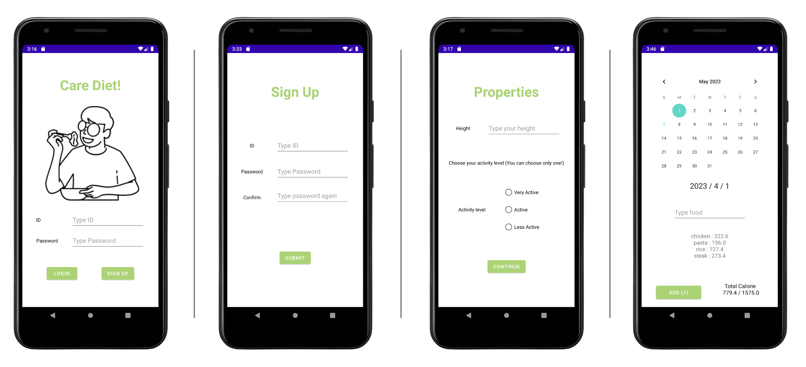

# Care Diet!
</img>
- Application : https://github.com/garden0628/Diet-Application  
- Flask-Server : https://github.com/garden0628/Diet-Application-Server  
- Notion : https://www.notion.so/Care-Diet-Application-60c63c0f7a3049fa814baddc28c47b89?pvs=4  

## Introduction
This is an android application for record food list for care diet.
1. Health care is becoming more and more prominent in modern society.
2. Fell the need for an app that allows people to manage their own health.
3. Designing an application to input the diet which you ate or will eat for people who think important of diet and calories.

## Development Period
2022 May ~ 2022 June

## Development Environment
- Android Studio (Java)
- Flask (Python)
- Zappa
- AWS Lambda
- AWS PostgreSQL

## Application Version
- minSdkVersion : 26
- targetSdkVersion : 32

## Usage API
- API from 'CalorieNinja' for get calorie Information (Homepage : https://calorieninjas.com/)

## Development Content
- Implement register and login
- Calculate daily recommendation calories by height and active state
- Interlock with CalorieNinjas API which produce calorie information
- Store foods, food's calorie and calories per day
- Store member information, food and calories by date on AWS PostgreSQL RDS using Flask and zappa-server 

## I Learned
- 안드로이드 앱 개발 개인 프로젝트를 진행하면서, 실용적인 아이템에 대해 고민하고 어떻게 하면 사용자들에게 쉽고 친근하게 다가갈 수 있는지 고민했던 시간이었다.
- 수 없이 많은 에러와 싸우고 고민하면서 스스로가 성장하고 있다는 느낌을 조금이나마 느낄 수 있었다.
- 실력을 키워 큰 프로젝트에 참여하고 싶다는 생각을 했다.

